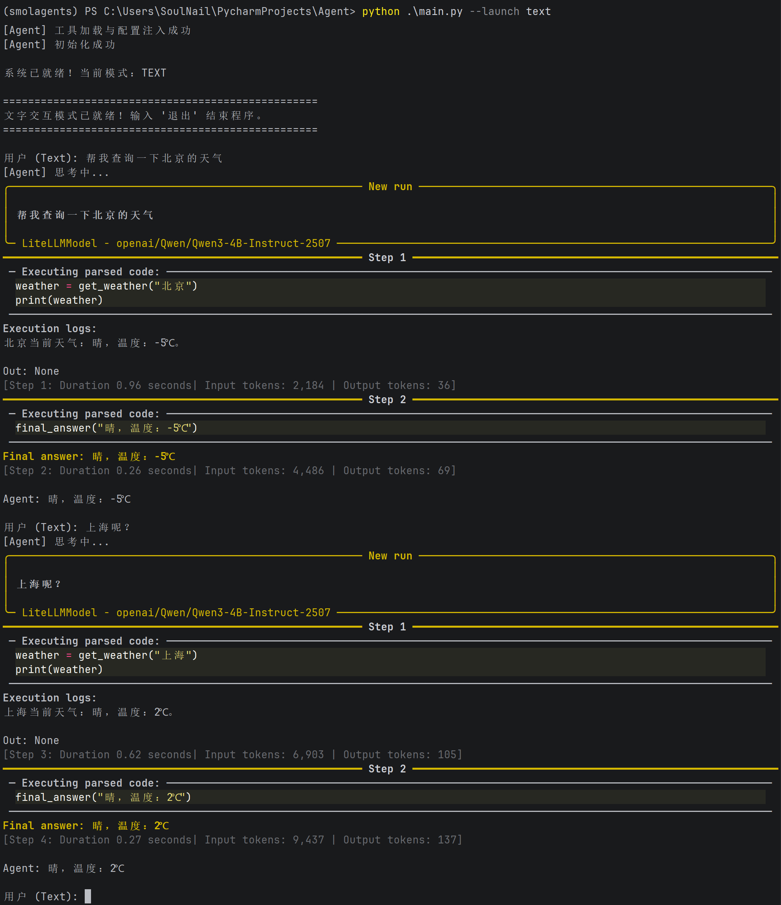

# 🎙️ Voice-SmolAgent

一个基于 **smolagents** 构建的多模态智能语音助手，支持实时语音对话（STT/TTS）与文本交互双模式。通过代码解释器（Code Agent）或工具调用，实现自然语言对物理世界工具（如天气、搜索）的控制。

---

## ✨ 核心特性

* **双模式启动**：支持 `--launch talk`（语音）和 `--launch text`（文字）两种交互模式。
* **智能语音流水线**：
* **VAD 录音**：自动检测人声，实现静音切分。
* **Whisper STT**：高精度的语音转文字。
* **Fish Speech TTS**：流式合成极具表现力的语音响应。


* **Code-Agent 驱动**：基于 `smolagents`，能够通过编写和执行 Python 代码来精准调用工具。
* **异步音频处理**：采用异步任务队列播放语音，确保 Agent 思考与语音播报的流畅衔接。

---

## 🛠️ 技术栈

| 组件 | 技术选型                                                 |
| --- |------------------------------------------------------|
| **Agent 框架** | [smolagents](https://github.com/huggingface/smolagents) |
| **语言模型** | Qwen-3-4B(通过 LiteLLM 接入)                      |
| **语音识别 (STT)** | OpenAI Whisper                                       |
| **语音合成 (TTS)** | Fish Speech                                          |
| **配置管理** | Pydantic Settings                                    |

---

## 🚀 快速开始

### 1. 环境安装

```bash
git clone https://github.com/your-username/Voice-SmolAgent.git
cd Voice-SmolAgent
pip install -r requirements.txt

```

### 2. 配置

在服务器创建大模型接口和TTS服务，本人的docker-compose如下：

```shell
version: '3.8'

services:
  webui:
    image: fish-speech-webui:cuda
    container_name: fish-speech-webui
    build:
      context: .
      dockerfile: docker/Dockerfile
      args:
        BACKEND: cuda
        CUDA_VER: 12.6.0
        UV_EXTRA: cu126
      target: webui
    ports:
      - "7860:7860"
    volumes:
      - ./models:/app/checkpoints
      - ./data:/app/data
    environment:
      - BACKEND=cuda
      - COMPILE=1
    deploy:
      resources:
        reservations:
          devices:
            - driver: nvidia
              count: 1
              capabilities: [gpu]
    restart: unless-stopped

  server:
    image: fish-speech-server:cuda
    container_name: fish-speech-server
    build:
      context: .
      dockerfile: docker/Dockerfile
      args:
        BACKEND: cuda
        CUDA_VER: 12.6.0
        UV_EXTRA: cu126
      target: server
    ports:
      - "8080:8080"
    volumes:
      - ./models:/app/checkpoints
      - ./data:/app/data
    environment:
      - BACKEND=cuda
      - COMPILE=1
    deploy:
      resources:
        reservations:
          devices:
            - driver: nvidia
              count: 1
              capabilities: [gpu]
    restart: unless-stopped
```

```shell
version: '3.8'

services:
  vllm:
    image: vllm/vllm-openai:v0.13.0
    container_name: vllm-qwen
    runtime: nvidia
    environment:
      - HF_TOKEN=${HF_TOKEN}
      # 如果国内下载慢，可以取消下面这行的注释
      - HF_ENDPOINT=https://hf-mirror.com
      - HF_HUB_ENABLE_HF_TRANSFER=0

      # ===== vLLM 关键环境变量 =====
      # - VLLM_ATTENTION_BACKEND=DUAL_CHUNK_FLASH_ATTN
      # - VLLM_USE_V1=0
    volumes:
      - /home/wjs/.cache/huggingface:/root/.cache/huggingface
    ports:
      - "18000:8000"
    ipc: host # 必须为 host，确保双卡 NCCL 通信正常
    deploy:
      resources:
        reservations:
          devices:
            - driver: nvidia
              count: all # 使用所有显卡（双 4090）
              capabilities: [gpu]
    command: >
      --model Qwen/Qwen3-4B-Instruct-2507
      --tensor-parallel-size 2
      --gpu-memory-utilization 0.35
      --max-model-len 10240
    restart: unless-stopped
```
### 3. 运行程序

```bash
# 语音模式（默认）
python main.py --launch talk

# 文字模式
python main.py --launch text

```
---

运行示例：


---

## 📅 项目路线图 (Roadmap)

### 🟢 已完成 (Phase 1: 核心框架)

* [x] 基于 `smolagents` 的 CodeAgent 核心逻辑。
* [x] 整合 Whisper STT 与 Fish Speech TTS。
* [x] 实现 `VADRecorder` 自动人声感应。
* [x] 支持命令行参数切换语音/文字模式。
* [x] 接入基础天气查询工具 (`WeatherTool`)。

### 🟡 开发中 (Phase 2: 鲁棒性优化)

* [ ] **长短期记忆 (RAG)**：接入向量数据库，实现基于知识库的长期记忆。
* [ ] **模型适配优化**：针对小参数量模型（如 Qwen-4B/7B）优化 System Prompt，减少格式错误。
* [ ] **多工具集成**：接入 DuckDuckGo 搜索、本地文件操作工具。

### ⚪ 计划中 (Phase 3: 体验升级)

* [ ] **Web 交互界面**：开发基于 Streamlit 或 Gradio 的图形化界面。
* [ ] **情绪感知**：通过分析用户语调调整 TTS 的播报情感。
* [ ] **离线化部署**：支持完全离线的本地模型运行方案。

---

## 🤝 贡献

欢迎提交 Issue 或 Pull Request 来完善这个项目。

## 📄 开源协议

[MIT License](https://www.google.com/search?q=LICENSE)